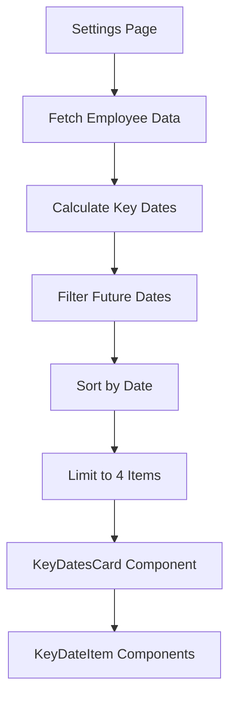

# Design Document: Employee Settings Key Dates Card

## Overview

This feature replaces the underutilized "Upcoming Working Pattern" card on the employee settings page with a "Key Dates & Reminders" card. The new card displays important upcoming dates for the employee including contract end dates, visa expiry, trial period end, and work anniversaries. Dates are sorted by urgency and include visual indicators for items requiring attention.

## Architecture

The implementation follows a server-side rendering approach consistent with the existing settings page. Date calculations and filtering are performed server-side, with the formatted data passed to a presentational component.



## Components and Interfaces

### KeyDateItem Interface

```typescript
interface KeyDateItem {
  id: string;
  label: string;
  date: Date;
  formattedDate: string;
  relativeDays: number;
  relativeText: string;
  type: 'contract' | 'visa' | 'trial' | 'anniversary';
  indicator: 'warning' | 'celebration' | null;
}
```

### Helper Functions

```typescript
// Calculate next work anniversary from start date
function calculateNextAnniversary(startDate: Date, referenceDate: Date): {
  date: Date;
  years: number;
}

// Build key dates array from employee data
function buildKeyDates(employee: EmployeeData, today: Date): KeyDateItem[]

// Format relative time text
function formatRelativeTime(days: number): string
```

### Component Structure

```
app/(withSidebar)/employees/[id]/settings/page.tsx
  └── KeyDatesCard (inline or extracted component)
        └── KeyDateItem (repeated for each date)
```

## Data Models

### Input Data (from Employee model)

| Field | Type | Usage |
|-------|------|-------|
| contractEndDate | DateTime? | Contract expiry tracking |
| visaExpiryDate | DateTime? | Immigration compliance |
| ninetyDayTrialPeriod | Boolean | Trial period flag |
| trialPeriodEndDate | DateTime? | Trial end tracking |
| startDate | DateTime? | Anniversary calculation |

### Warning Thresholds

| Date Type | Warning Threshold | Indicator |
|-----------|------------------|-----------|
| Contract End | 30 days | warning (amber) |
| Visa Expiry | 90 days | warning (amber) |
| Trial Period | 14 days | warning (amber) |
| Anniversary | 30 days | celebration (purple/confetti) |

## Correctness Properties

*A property is a characteristic or behavior that should hold true across all valid executions of a system—essentially, a formal statement about what the system should do. Properties serve as the bridge between human-readable specifications and machine-verifiable correctness guarantees.*

### Property 1: Date Type Inclusion
*For any* employee with a contractEndDate, visaExpiryDate, or trialPeriodEndDate (with ninetyDayTrialPeriod=true) set to a future date, the buildKeyDates function SHALL include that date in the output array.
**Validates: Requirements 2.1, 3.1, 4.1**

### Property 2: Anniversary Calculation
*For any* employee with a startDate, the buildKeyDates function SHALL calculate and include the next work anniversary with the correct year count.
**Validates: Requirements 5.1, 5.2, 5.3**

### Property 3: Warning Indicator Assignment
*For any* key date within its type-specific warning threshold (contract: 30 days, visa: 90 days, trial: 14 days, anniversary: 30 days), the indicator field SHALL be set to the appropriate value ('warning' or 'celebration').
**Validates: Requirements 2.4, 3.4, 4.4, 5.4**

### Property 4: Output Ordering and Limiting
*For any* set of key dates, the output SHALL be sorted in ascending date order, limited to 4 items, and exclude all dates in the past.
**Validates: Requirements 6.1, 6.2, 6.3, 6.4**

### Property 5: Date Formatting
*For any* key date, the formattedDate field SHALL match the "MMM d, yyyy" pattern and the relativeText field SHALL contain a valid relative time string.
**Validates: Requirements 7.1, 7.2**

## Error Handling

| Scenario | Handling |
|----------|----------|
| No dates available | Display "No upcoming key dates" message |
| Invalid date values | Skip the invalid date, continue with others |
| All dates in past | Display "No upcoming key dates" message |

## Testing Strategy

### Unit Tests
- Test `calculateNextAnniversary` with various start dates and reference dates
- Test `buildKeyDates` with edge cases (no dates, all dates, past dates)
- Test `formatRelativeTime` for "today", "tomorrow", "in X days" cases
- Test warning threshold logic for each date type

### Property-Based Tests
Using a property-based testing library (e.g., fast-check), we will verify:

1. **Date inclusion property**: Generate random employee data with various date combinations and verify all future dates are included
2. **Anniversary calculation property**: Generate random start dates and verify anniversary calculation is correct
3. **Warning indicator property**: Generate dates at various distances from today and verify correct indicator assignment
4. **Ordering property**: Generate random date sets and verify output is always sorted ascending
5. **Limiting property**: Generate date sets of various sizes and verify output never exceeds 4 items

Each property test will run minimum 100 iterations to ensure comprehensive coverage.

### Integration Tests
- Verify the settings page renders the KeyDatesCard component
- Verify correct data is fetched and displayed for a test employee
