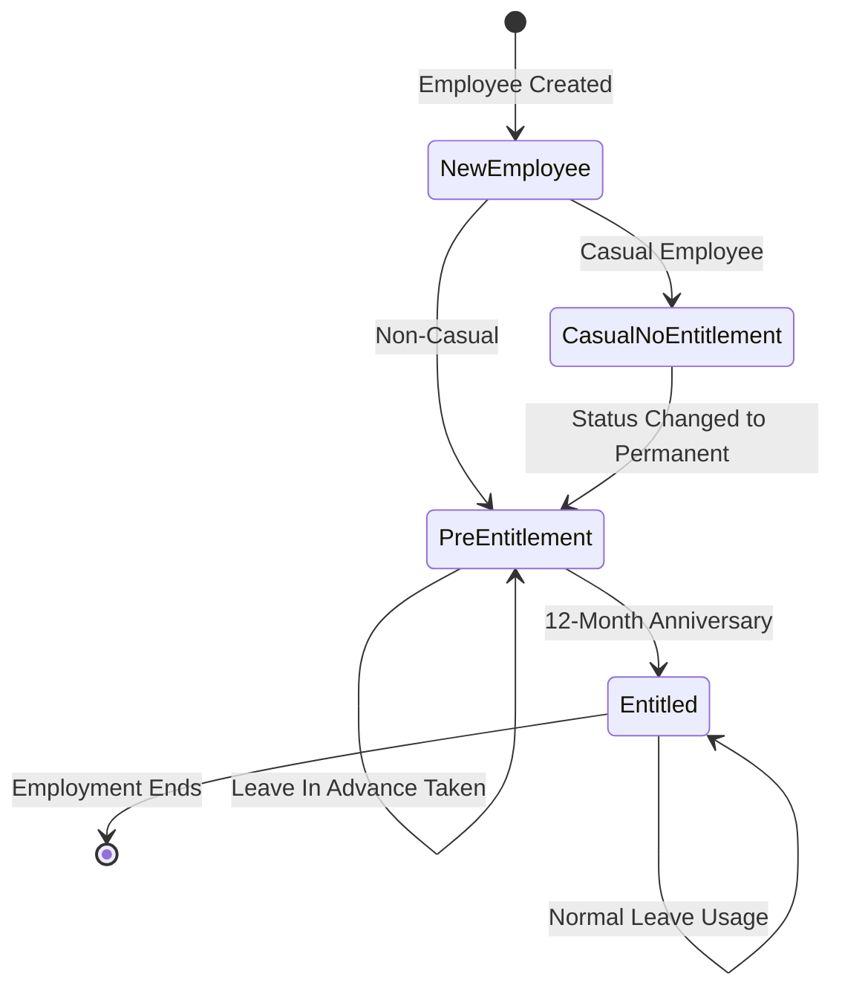

# Design Document: NZ Annual Leave Compliance Refactor

## Overview

This design document describes the targeted refactor of PeopleCore's annual leave entitlement logic to comply with the New Zealand Holidays Act 2003. The refactor follows a minimal-change approach: modifying existing models and flows rather than rebuilding, preserving the existing pro-rata calculator in AddEmployeeModal, and maintaining backward compatibility with existing leave records.

### Key Legal Requirements (NZ Holidays Act 2003)
- Employees are NOT entitled to annual leave until 12 months after employment start
- At 12-month anniversary: 4 weeks (20 days for full-time, pro-rata for part-time)
- Leave taken before 12 months = "leave in advance" (deducted from future entitlement)
- Casual employees receive 8% holiday pay instead of annual leave accrual

### Design Principles
1. **Preserve existing UX** - Calculator, leave request flows, approval workflows unchanged
2. **Additive schema changes** - No breaking changes to existing models
3. **Backward compatible** - Existing employees with LeaveEntitlement records continue working
4. **Minimal code changes** - Extend existing logic rather than replace

## Architecture

```mermaid
flowchart TD
    subgraph Employee Creation
        A[AddEmployeeModal] --> B[Pro-Rata Calculator]
        B --> C[Calculate Future Entitlement]
        C --> D{Is Casual?}
        D -->|Yes| E[No Entitlement Stored]
        D -->|No| F[Store Future Entitlement on Employee]
        F --> G[Calculate Anniversary Date]
    end
    
    subgraph Anniversary Grant Process
        H[Scheduled Job / Cron] --> I[Find Employees at Anniversary]
        I --> J[For Each Employee]
        J --> K[Get Future Entitlement]
        K --> L[Get Leave In Advance Used]
        L --> M[Create LeaveEntitlement Record]
        M --> N[Balance = Future - LeaveInAdvance]
        N --> O[Create Audit Log]
    end
    
    subgraph Leave Request Flow
        P[Leave Request] --> Q{Employee < 12 months?}
        Q -->|Yes| R[Classify as Leave In Advance]
        Q -->|No| S[Normal Leave Request]
        R --> T[Record in leaveInAdvanceUsed]
        S --> U[Deduct from LeaveEntitlement]
    end
```



## Components and Interfaces

### Modified Files

#### 1. `prisma/schema.prisma` - Employee Model Extension
Add new fields to existing Employee model (additive only):

```prisma
model Employee {
  // ... existing fields ...
  
  // NZ Annual Leave Compliance (Holidays Act 2003)
  /// Future annual leave entitlement (days) - granted at 12-month anniversary
  futureAnnualLeaveEntitlement  Decimal?  @db.Decimal(8, 2)
  /// Date when annual leave entitlement crystallises (12 months from start)
  annualLeaveEntitlementDate    DateTime?
  /// Leave in advance taken before 12-month anniversary (days)
  leaveInAdvanceUsed            Decimal   @default(0) @db.Decimal(8, 2)
  /// Whether employee is casual (receives 8% holiday pay instead)
  isCasualEmployee              Boolean   @default(false)
  /// Date casual status changed to permanent (for anniversary calculation)
  casualToPermanentDate         DateTime?
}
```

#### 2. `app/api/employees/route.ts` - Employee Creation
Modify POST handler to:
- Store `futureAnnualLeaveEntitlement` instead of creating LeaveEntitlement
- Calculate and store `annualLeaveEntitlementDate` (startDate + 12 months)
- Skip entitlement for casual employees
- Preserve existing pro-rata calculator integration

#### 3. `app/lib/validateLeaveRequest.ts` - Leave Request Validation
Extend to:
- Check if employee is under 12 months
- Classify request as "leave in advance" if applicable
- Allow leave in advance (with appropriate tracking)

#### 4. `app/lib/advanceLeaveApproval.ts` - Leave Approval
Extend to:
- Track leave in advance usage in `leaveInAdvanceUsed` field
- Skip LeaveEntitlement deduction for pre-12-month employees

#### 5. `app/components/employees/AddEmployeeModal.tsx` - UI Updates
Minimal changes:
- Add clarifying text that entitlement is granted at 12 months
- Preserve existing calculator functionality

#### 6. `app/components/LeaveBalancePanel.tsx` - Balance Display
Extend to:
- Show "Accrued (not yet entitled)" label for <12 month employees
- Display leave in advance used separately
- Show future entitlement amount

### New Files

#### 1. `lib/leave/annual-leave-anniversary.ts` - Anniversary Grant Logic
```typescript
interface AnniversaryGrantResult {
  employeeId: string;
  grantedDays: number;
  leaveInAdvanceDeducted: number;
  finalBalance: number;
  flaggedForReview: boolean;
}

export async function processAnniversaryGrant(
  employeeId: string,
  grantDate: Date
): Promise<AnniversaryGrantResult>;

export async function findEmployeesAtAnniversary(
  companyId: string,
  targetDate: Date
): Promise<Employee[]>;

export async function processAllAnniversaryGrants(
  companyId: string
): Promise<AnniversaryGrantResult[]>;
```

#### 2. `app/api/cron/annual-leave-anniversary/route.ts` - Scheduled Job
Endpoint for scheduled anniversary processing (Vercel Cron or similar).

## Data Models

### Employee Model Changes (Additive)

| Field | Type | Description | Default |
|-------|------|-------------|---------|
| `futureAnnualLeaveEntitlement` | Decimal(8,2)? | Pro-rata calculated entitlement to be granted at 12 months | null |
| `annualLeaveEntitlementDate` | DateTime? | Date when entitlement crystallises (startDate + 12 months) | null |
| `leaveInAdvanceUsed` | Decimal(8,2) | Days of leave taken before 12-month anniversary | 0 |
| `isCasualEmployee` | Boolean | Whether employee receives 8% holiday pay instead | false |
| `casualToPermanentDate` | DateTime? | Date status changed (for anniversary recalculation) | null |

### State Transitions



## Correctness Properties

*A property is a characteristic or behavior that should hold true across all valid executions of a system—essentially, a formal statement about what the system should do. Properties serve as the bridge between human-readable specifications and machine-verifiable correctness guarantees.*

### Property 1: Future Entitlement Storage (Not Active Balance)
*For any* newly created non-casual employee, the system SHALL store the calculated entitlement in `futureAnnualLeaveEntitlement` and SHALL NOT create a LeaveEntitlement record until the 12-month anniversary.

**Validates: Requirements 1.1, 1.5**

### Property 2: Anniversary Date Calculation
*For any* newly created employee with a valid start date, the `annualLeaveEntitlementDate` SHALL equal exactly 12 months after the `employmentStartDate` (or `casualToPermanentDate` for converted casuals).

**Validates: Requirements 1.2, 1.3**

### Property 3: Anniversary Grant with Deduction
*For any* employee reaching their 12-month anniversary, the created LeaveEntitlement balance SHALL equal `futureAnnualLeaveEntitlement - leaveInAdvanceUsed`, with a minimum of 0.

**Validates: Requirements 2.1, 2.2**

### Property 4: Leave In Advance Classification
*For any* annual leave request from an employee with less than 12 months service (no LeaveEntitlement record), the request SHALL be classified as leave in advance and recorded in `leaveInAdvanceUsed` upon approval.

**Validates: Requirements 3.1, 3.2**

### Property 5: Casual Employee Exclusion
*For any* employee marked as `isCasualEmployee = true`, the system SHALL NOT store a `futureAnnualLeaveEntitlement` value and SHALL NOT create LeaveEntitlement records.

**Validates: Requirements 4.1**

### Property 6: Casual to Permanent Conversion
*For any* employee whose `isCasualEmployee` changes from true to false, the `annualLeaveEntitlementDate` SHALL be recalculated as 12 months from the `casualToPermanentDate`.

**Validates: Requirements 4.4**

### Property 7: Existing Records Preservation
*For any* existing LeaveEntitlement record, the migration and new logic SHALL NOT modify or delete the record. Employees with existing LeaveEntitlement records SHALL be treated as having crystallised entitlement.

**Validates: Requirements 6.1, 6.2, 6.5**

### Property 8: Upcoming Anniversary Query
*For any* query for employees approaching their 12-month anniversary, the result SHALL include all employees where `annualLeaveEntitlementDate` is within the specified range (e.g., 30 days) and who do not yet have a LeaveEntitlement record.

**Validates: Requirements 7.1**

### Property 9: Report Distinction
*For any* leave report generation, the output SHALL distinguish between entitled leave (from LeaveEntitlement.usedDays) and leave in advance (from Employee.leaveInAdvanceUsed).

**Validates: Requirements 7.4**

### Property 10: Audit Log Creation
*For any* anniversary grant operation, the system SHALL create an audit log entry containing the employee ID, grant date, granted amount, deducted leave in advance, and final balance.

**Validates: Requirements 2.4**

## Error Handling

### Leave In Advance Exceeds Entitlement
When `leaveInAdvanceUsed > futureAnnualLeaveEntitlement`:
1. Set LeaveEntitlement balance to 0
2. Set `flaggedForReview = true` in grant result
3. Create ActionItem for HR review with details
4. Log warning with employee details

### Missing Employment Start Date
If `employmentStartDate` is null when calculating anniversary:
1. Fall back to `startDate` field
2. Log warning for data quality review
3. Continue with calculation

### Casual Employee Leave Request
If casual employee attempts to request annual leave:
1. Return validation error with clear message
2. Suggest contacting HR about 8% holiday pay

## Testing Strategy

### Unit Tests
- Anniversary date calculation (various start dates, leap years)
- Leave in advance deduction calculation
- Casual employee detection
- Existing record preservation logic

### Property-Based Tests
Using fast-check or similar PBT library:

1. **Future Entitlement Storage Property** (Property 1)
   - Generate random employee creation data
   - Verify no LeaveEntitlement created, futureAnnualLeaveEntitlement stored

2. **Anniversary Grant Property** (Property 3)
   - Generate random employees with various futureEntitlement and leaveInAdvanceUsed
   - Verify final balance = max(0, future - advance)

3. **Leave In Advance Classification Property** (Property 4)
   - Generate random leave requests for employees at various tenure lengths
   - Verify correct classification based on 12-month threshold

4. **Casual Exclusion Property** (Property 5)
   - Generate random casual employees
   - Verify no entitlement fields populated

5. **Existing Records Preservation Property** (Property 7)
   - Generate employees with existing LeaveEntitlement records
   - Run migration/new logic
   - Verify records unchanged

### Integration Tests
- Full employee creation flow with calculator
- Leave request → approval → tracking flow
- Anniversary grant scheduled job
- Report generation with distinction

### Migration Tests
- Existing employees with LeaveEntitlement continue working
- Existing employees without LeaveEntitlement get new fields populated
- No data loss or corruption
