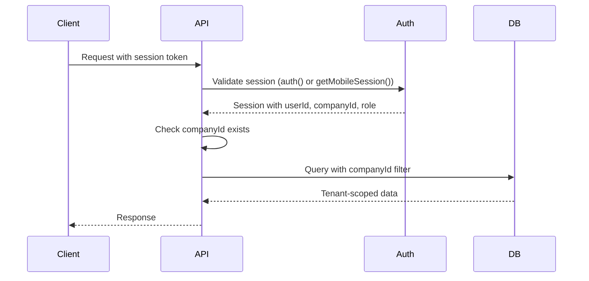
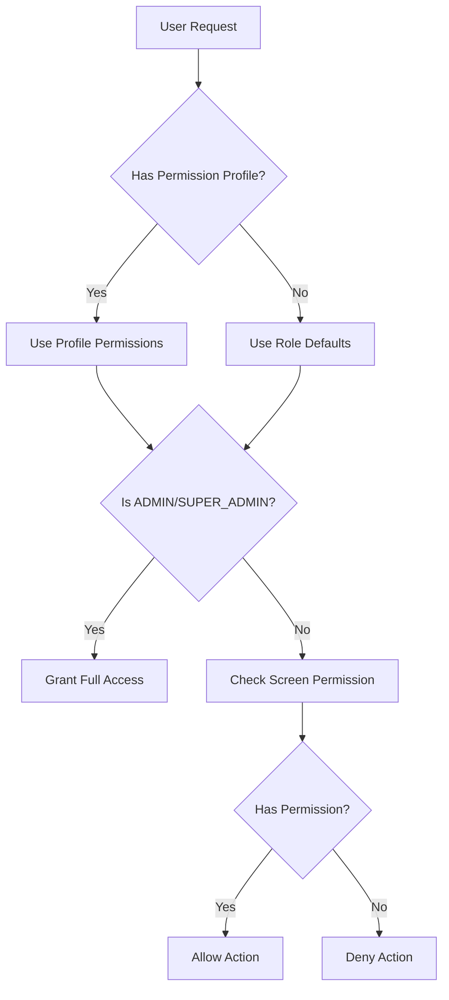

# Design Document: Production Readiness Audit

## Overview

This design document outlines the comprehensive security audit approach for PeopleCore HRIS before production deployment. The audit covers 7 core modules: Employees, Dashboards, Reports, Surveys, News, Leave Booking & Calendars, and Documents.

## Architecture

### Current Security Architecture

The system implements a layered security model:

```
┌─────────────────────────────────────────────────────────────┐
│                    API Layer (Next.js Routes)                │
├─────────────────────────────────────────────────────────────┤
│  Authentication │  Authorization  │  Input Validation       │
│  (NextAuth v5)  │  (RBAC + Perms) │  (Zod Schemas)          │
├─────────────────────────────────────────────────────────────┤
│                    Tenant Isolation Layer                    │
│              (companyId filtering on all queries)            │
├─────────────────────────────────────────────────────────────┤
│                    Data Layer (Prisma ORM)                   │
│              (Parameterized queries - no raw SQL)            │
└─────────────────────────────────────────────────────────────┘
```

### Authentication Flow



### Permission Resolution



## Components and Interfaces

### Core Security Functions

| Function | Location | Purpose |
|----------|----------|---------|
| `auth()` | `lib/auth-options.ts` | Web session authentication |
| `getMobileSession()` | `lib/mobile-session.ts` | Mobile session authentication |
| `hasPermission()` | `lib/permissions.ts` | Check screen/action permission |
| `canAccessEmployee()` | `lib/permissions.ts` | Validate employee access |
| `isSameTenant()` | `lib/authz.ts` | Tenant isolation check |

### API Security Patterns

All API routes follow this pattern:

```typescript
export async function GET(req: Request) {
  // 1. Authentication
  const session = await getMobileSession(req);
  if (!session?.user?.companyId) {
    return NextResponse.json({ error: "Unauthorized" }, { status: 401 });
  }

  // 2. Authorization (if needed)
  if (!hasPermission(user, 'screen', 'action')) {
    return NextResponse.json({ error: "Forbidden" }, { status: 403 });
  }

  // 3. Tenant-scoped query
  const data = await prisma.resource.findMany({
    where: { companyId: session.user.companyId }
  });

  return NextResponse.json(data);
}
```

## Data Models

### Key Security-Related Models

```prisma
model User {
  id                String   @id
  companyId         String   // Tenant isolation key
  role              Role     // ADMIN, MANAGER, EMPLOYEE, SUPER_ADMIN
  permissionProfileId String? // Custom permissions
}

model Employee {
  id        String @id
  companyId String // Tenant isolation key
  userId    String // Links to User
}

model Document {
  id              String  @id
  companyId       String  // Tenant isolation key
  canViewAdmin    Boolean
  canViewManager  Boolean
  canViewEmployee Boolean
}
```

## Correctness Properties

*A property is a characteristic or behavior that should hold true across all valid executions of a system—essentially, a formal statement about what the system should do. Properties serve as the bridge between human-readable specifications and machine-verifiable correctness guarantees.*

### Property 1: Tenant Isolation

*For any* API request to a tenant-scoped resource, the database query SHALL include a companyId filter matching the authenticated user's companyId.

**Validates: Requirements 2.1, 4.1, 5.1, 7.1, 8.1, 9.1**

### Property 2: Cross-Tenant Access Prevention

*For any* attempt to access a resource belonging to a different tenant, the system SHALL return 404 (not 403) to prevent ID enumeration.

**Validates: Requirements 2.2, 11.4**

### Property 3: Role-Based Access Control

*For any* user with a given role (ADMIN, MANAGER, EMPLOYEE), the system SHALL enforce the appropriate access restrictions:
- ADMIN/SUPER_ADMIN: Full access to company resources
- MANAGER: Access to direct/indirect reports and department colleagues
- EMPLOYEE: Access to own data and limited department colleague data

**Validates: Requirements 3.1, 3.2, 3.3**

### Property 4: Permission Profile Override

*For any* user with a custom permission profile, the profile permissions SHALL take precedence over role-based defaults (except ADMIN/SUPER_ADMIN always have full access).

**Validates: Requirements 3.4**

### Property 5: Document Visibility

*For any* document with visibility restrictions (canViewAdmin, canViewManager, canViewEmployee, department, jobRole), the system SHALL only return the document to users matching ALL applicable criteria.

**Validates: Requirements 5.5, 5.6**

### Property 6: Calendar Privacy

*For any* calendar query:
- Sickness leave SHALL never be visible to colleagues (only self, direct manager, admin)
- Visibility scope (OWN, DEPARTMENT, COMPANY) SHALL be enforced
- Managers SHALL be restricted to their org scope (never company-wide)

**Validates: Requirements 6.1, 6.2, 6.3, 6.4**

### Property 7: File Upload Validation

*For any* file upload, the system SHALL:
- Validate file type against allowlist (PDF, PNG, JPEG, DOC, DOCX)
- Enforce maximum file size (10MB)
- Sanitize file names (remove special characters)

**Validates: Requirements 5.2, 5.3, 10.3**

### Property 8: Pagination Limits

*For any* paginated API request, the system SHALL enforce:
- Maximum limit of 100 records per page
- Maximum skip of 10,000 records

**Validates: Requirements 4.4, 10.4**

### Property 9: Input Validation Response

*For any* request with invalid input data, the system SHALL return 400 with descriptive error details (not 500).

**Validates: Requirements 10.2**

### Property 10: Authentication Required

*For any* API endpoint (except public endpoints), unauthenticated requests SHALL receive 401 Unauthorized.

**Validates: Requirements 1.1**

## Error Handling

### Error Response Strategy

| Scenario | Status Code | Response |
|----------|-------------|----------|
| No session | 401 | `{ error: "Unauthorized" }` |
| Invalid permissions | 403 | `{ error: "Forbidden" }` |
| Resource not found (same tenant) | 404 | `{ error: "Not found" }` |
| Resource not found (cross-tenant) | 404 | `{ error: "Not found" }` |
| Validation error | 400 | `{ error: "...", details: [...] }` |
| Server error | 500 | `{ error: "Internal Server Error" }` |

### Security Considerations

- Never expose stack traces in production
- Use 404 (not 403) for cross-tenant access to prevent enumeration
- Log detailed errors server-side only
- Sanitize error messages to prevent information leakage

## Testing Strategy

### Dual Testing Approach

The audit uses both unit tests and property-based tests:

1. **Unit Tests**: Verify specific examples and edge cases
2. **Property Tests**: Verify universal properties across all inputs

### Test Categories

#### 1. Authentication Tests
- Unauthenticated request rejection
- Expired session handling
- Mobile vs web session support

#### 2. Tenant Isolation Tests
- Cross-tenant access prevention
- companyId filter verification
- ID enumeration prevention (404 vs 403)

#### 3. Authorization Tests
- Role-based access (ADMIN, MANAGER, EMPLOYEE)
- Permission profile override
- Manager hierarchy validation

#### 4. Module-Specific Tests

**Employees Module:**
- CRUD operations with tenant scoping
- Email uniqueness validation
- Manager assignment validation
- Pagination limits

**Documents Module:**
- File type validation
- File size limits
- Visibility flag enforcement
- Signed URL generation

**Calendar/Leave Module:**
- Sickness leave privacy
- Visibility scope enforcement
- Manager access restrictions

**Reports Module:**
- Query parameterization (no SQL injection)
- Field allowlist validation
- Share recipient validation

**News Module:**
- Audience filtering
- Admin-only email sending
- Permission validation

**Surveys Module:**
- Form template tenant validation
- Audience criteria validation

### Existing Test Coverage

The codebase already has 28+ API security tests:

| Test File | Coverage |
|-----------|----------|
| `employees-cross-tenant.test.ts` | Tenant isolation |
| `employees-pagination.test.ts` | Pagination security |
| `employees-subordinates.test.ts` | Manager hierarchy |
| `documents-download.test.ts` | Document access |
| `documents-sign.test.ts` | Signature workflow |
| `calendar-events-manager-visibility.test.ts` | Calendar privacy |
| `designer-security.test.ts` | Template security |
| `reports-share-access.test.ts` | Report sharing |
| `newsRouteAuth.test.ts` | News authentication |

### Test Configuration

- Minimum 100 iterations per property test
- Each test references design document property
- Tag format: **Feature: production-readiness-audit, Property {number}: {property_text}**

## Audit Checklist

### Pre-Production Checklist

#### Security
- [ ] All API routes have authentication checks
- [ ] All tenant-scoped queries include companyId filter
- [ ] Cross-tenant access returns 404 (not 403)
- [ ] Permission checks on all mutations
- [ ] Input validation on all POST/PUT endpoints
- [ ] File upload validation (type, size)
- [ ] No raw SQL queries (use Prisma ORM)

#### Testing
- [ ] Run full test suite: `npm test`
- [ ] All security tests pass
- [ ] No critical vulnerabilities in dependencies (`npm audit`)

#### Configuration
- [ ] Environment variables set correctly
- [ ] Database backups configured
- [ ] Error logging configured (no stack traces in responses)

#### Monitoring
- [ ] Error tracking enabled (Sentry)
- [ ] Performance monitoring enabled
- [ ] Audit logging for sensitive operations

### Known Gaps to Address

1. **Rate Limiting**: No rate limiting on email sending (news, documents)
   - Recommendation: Implement rate limiting middleware (10 emails/minute per user)

2. **Virus Scanning**: No virus scanning on file uploads
   - Recommendation: Integrate virus scanning service or defer to production infrastructure

3. **Session Expiry**: Verify session expiry is properly configured
   - Recommendation: Review NextAuth session configuration
