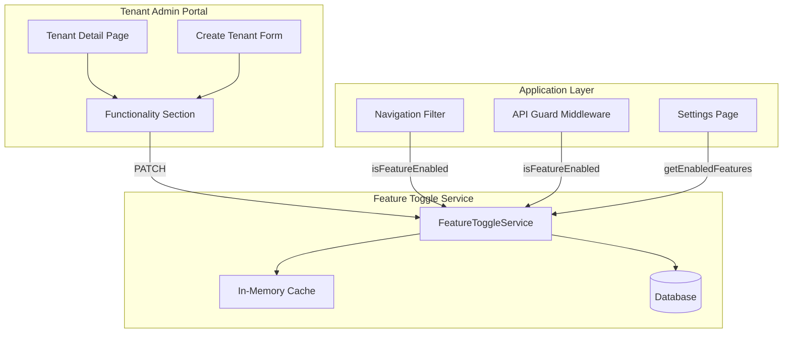

# Design Document: Tenant Feature Toggles

## Overview

This design implements a tenant-level feature toggle system that allows system administrators to enable or disable specific modules for each tenant. The system integrates with the existing tenant-admin portal and affects navigation visibility, API access, and settings availability.

The architecture follows a layered approach:
1. **Data Layer** - Prisma model for storing toggle states
2. **Service Layer** - Cached feature toggle service with invalidation
3. **Guard Layer** - API middleware and navigation filtering
4. **UI Layer** - Tenant-admin configuration and filtered navigation

## Compatibility & Regression Analysis

### Multi-Tenant Scalability Confirmation

✅ **Tenant Isolation**: The design follows the existing `companyId` pattern used throughout the codebase:
- All feature toggle queries are scoped by `companyId` (same as employees, documents, etc.)
- Cache keys include `companyId` to prevent cross-tenant data leakage
- API guards extract `companyId` from session using existing `session.user.companyId` pattern

✅ **Existing Patterns Followed**:
- **Authentication**: Uses existing `lib/tenant-admin-auth.ts` signed token pattern
- **Caching**: Follows `lib/cache.ts` pattern with Redis/memory fallback
- **API Responses**: Uses existing 403 Forbidden pattern (`NextResponse.json({ error: "..." }, { status: 403 })`)
- **Session Context**: Uses `createAuthContext()` from `app/lib/authz.ts`

✅ **No Breaking Changes**:
- Feature toggles default to `true` (enabled) - existing tenants see no change
- Navigation filtering is additive (removes items, doesn't add new ones)
- API guards are opt-in per route (existing routes unchanged unless explicitly guarded)
- Database migration adds new table, doesn't modify existing tables

### Regression Prevention

1. **Backward Compatibility**: All features enabled by default for existing tenants
2. **Fail-Open Design**: If cache/DB fails, features remain accessible (better UX than blocking)
3. **Gradual Rollout**: Guards can be added incrementally per API route
4. **No Core Route Blocking**: Dashboard, Employees, Calendar, Documents, Reports, Leave always accessible

## Architecture



## Components and Interfaces

### 1. Feature Toggle Data Model

```prisma
model TenantFeatureToggle {
  id        String   @id @default(cuid())
  companyId String
  featureKey String
  isEnabled Boolean  @default(true)
  createdAt DateTime @default(now())
  updatedAt DateTime @updatedAt
  
  company   Company  @relation(fields: [companyId], references: [id], onDelete: Cascade)
  
  @@unique([companyId, featureKey])
  @@index([companyId])
}
```

### 2. Feature Keys Enum

```typescript
// lib/feature-toggles/types.ts
export const FEATURE_KEYS = {
  AI_ASSISTANT: 'ai_assistant',
  NEWS: 'news',
  BULK_ACTIONS: 'bulk_actions',
  PERFORMANCE_MANAGEMENT: 'performance_management',
  JOURNEYS: 'journeys',
  ONBOARDING: 'onboarding',
  AUTOMATION_RULES: 'automation_rules',
  EVENT_RULES: 'event_rules',
  ORG_CHART: 'org_chart',
  SURVEYS: 'surveys',
  FORMS: 'forms',
  TIMESHEETS: 'timesheets',
  ROTA_SHIFTS: 'rota_shifts',
  MULTI_STAGE_APPROVALS: 'multi_stage_approvals',
  ANALYTICS: 'analytics',
} as const;

export type FeatureKey = typeof FEATURE_KEYS[keyof typeof FEATURE_KEYS];

export interface FeatureToggleState {
  [key: string]: boolean;
}

export interface FeatureCategory {
  name: string;
  description: string;
  features: {
    key: FeatureKey;
    label: string;
    description: string;
  }[];
}
```

### 3. Feature Toggle Service

```typescript
// lib/feature-toggles/service.ts
import { prisma } from "@/lib/prisma";
import { documentStatusCache } from "@/lib/cache"; // Reuse existing cache infrastructure

export interface IFeatureToggleService {
  isFeatureEnabled(companyId: string, featureKey: FeatureKey): Promise<boolean>;
  getEnabledFeatures(companyId: string): Promise<FeatureToggleState>;
  setFeatureEnabled(companyId: string, featureKey: FeatureKey, enabled: boolean): Promise<void>;
  bulkSetFeatures(companyId: string, features: Partial<FeatureToggleState>): Promise<void>;
  initializeDefaultToggles(companyId: string, enabledFeatures?: FeatureKey[]): Promise<void>;
  invalidateCache(companyId: string): void;
}

// Cache key format follows existing pattern: feature-toggles:{companyId}
const CACHE_KEY_PREFIX = "feature-toggles";
const CACHE_TTL_SECONDS = 300; // 5 minutes

function getCacheKey(companyId: string): string {
  return `${CACHE_KEY_PREFIX}:${companyId}`;
}
```

### 4. Navigation Filter Hook

```typescript
// app/hooks/useFeatureToggles.ts
export interface UseFeatureTogglesResult {
  isLoading: boolean;
  isFeatureEnabled: (featureKey: FeatureKey) => boolean;
  enabledFeatures: FeatureToggleState;
  filterNavItems: <T extends { href: string }>(items: T[]) => T[];
}
```

### 5. API Guard Middleware

```typescript
// lib/feature-toggles/api-guard.ts
import { NextResponse } from "next/server";
import { auth } from "@/lib/auth";
import { featureToggleService } from "./service";

export interface FeatureGuardConfig {
  featureKey: FeatureKey;
  paths: string[];
}

/**
 * Higher-order function to wrap API route handlers with feature guard
 * Follows existing pattern from app/api routes
 */
export function withFeatureGuard(featureKey: FeatureKey) {
  return function <T extends (...args: any[]) => Promise<Response>>(handler: T): T {
    return (async (...args: Parameters<T>) => {
      const session = await auth();
      
      if (!session?.user?.companyId) {
        return NextResponse.json({ error: "Unauthorized" }, { status: 401 });
      }
      
      const isEnabled = await featureToggleService.isFeatureEnabled(
        session.user.companyId,
        featureKey
      );
      
      if (!isEnabled) {
        return NextResponse.json(
          { 
            error: "Feature not available", 
            code: "FEATURE_DISABLED", 
            feature: featureKey 
          }, 
          { status: 403 }
        );
      }
      
      return handler(...args);
    }) as T;
  };
}
```

## Data Models

### Feature Categories Configuration

```typescript
export const FEATURE_CATEGORIES: FeatureCategory[] = [
  {
    name: 'Core HR Tools',
    description: 'Essential HR management features',
    features: [
      { key: 'performance_management', label: 'Performance', description: 'Performance reviews and objectives' },
      { key: 'surveys', label: 'Surveys', description: 'Employee surveys and feedback' },
      { key: 'forms', label: 'Forms', description: 'Custom forms builder' },
      { key: 'org_chart', label: 'Org Chart', description: 'Organization visualization' },
      { key: 'analytics', label: 'Analytics', description: 'HR analytics and insights' },
    ],
  },
  {
    name: 'Automation',
    description: 'Workflow and process automation',
    features: [
      { key: 'automation_rules', label: 'Automation Rules', description: 'Workflow automation engine' },
      { key: 'event_rules', label: 'Event Rules', description: 'Event-triggered notifications' },
      { key: 'multi_stage_approvals', label: 'Multi-stage Approvals', description: 'Complex approval workflows' },
    ],
  },
  {
    name: 'Employee Experience',
    description: 'Employee engagement and onboarding',
    features: [
      { key: 'news', label: 'News', description: 'Company news and communications' },
      { key: 'journeys', label: 'Journeys', description: 'Employee journey workflows' },
      { key: 'onboarding', label: 'Onboarding', description: 'New employee onboarding' },
    ],
  },
  {
    name: 'Operations',
    description: 'Time tracking and bulk operations',
    features: [
      { key: 'timesheets', label: 'Timesheets', description: 'Timesheet management' },
      { key: 'rota_shifts', label: 'Rota & Shifts', description: 'Scheduling and reconciliation' },
      { key: 'bulk_actions', label: 'Bulk Actions', description: 'Bulk employee operations' },
    ],
  },
  {
    name: 'AI',
    description: 'AI-powered features',
    features: [
      { key: 'ai_assistant', label: 'AI Assistant', description: 'AI-powered HR assistant' },
    ],
  },
];
```

### Navigation Path Mapping

```typescript
export const FEATURE_TO_PATHS: Record<FeatureKey, string[]> = {
  ai_assistant: ['/api/ai'],
  news: ['/news', '/api/news'],
  bulk_actions: ['/bulk-actions', '/api/bulk-actions'],
  performance_management: ['/performance', '/api/performance'],
  journeys: ['/settings/journeys', '/api/journeys'],
  onboarding: ['/settings/onboarding', '/api/onboarding'],
  automation_rules: ['/settings/automation-rules', '/api/automation-rules'],
  event_rules: ['/settings/event-rules', '/api/event-rules'],
  org_chart: ['/org-chart', '/api/org-chart'],
  surveys: ['/surveys', '/settings/surveys', '/api/surveys'],
  forms: ['/settings/forms', '/api/forms'],
  timesheets: ['/admin/timesheets', '/api/timesheets'],
  rota_shifts: ['/rota', '/admin/reconciliation', '/api/rota-groups', '/api/shifts', '/api/reconciliation'],
  multi_stage_approvals: ['/settings/multi-stage-approvals', '/api/approval-workflows'],
  analytics: ['/analytics', '/api/analytics'],
};
```


## Correctness Properties

*A property is a characteristic or behavior that should hold true across all valid executions of a system—essentially, a formal statement about what the system should do. Properties serve as the bridge between human-readable specifications and machine-verifiable correctness guarantees.*

### Property 1: Toggle Persistence Round-Trip

*For any* tenant and any feature key, setting a toggle to a value and then reading it back should return the same value.

**Validates: Requirements 1.1, 2.3**

### Property 2: Default Toggle Initialization

*For any* newly created tenant, all 15 feature toggles should be created with `isEnabled` matching the selected features (or all true if no selection made).

**Validates: Requirements 1.2, 2.7**

### Property 3: Navigation Filtering Consistency

*For any* sidebar type (admin, manager, employee) and any disabled feature, navigation items mapped to that feature should not appear in the rendered navigation.

**Validates: Requirements 3.1, 3.2, 3.3**

### Property 4: Settings Card Filtering

*For any* feature toggle that is disabled, its corresponding settings card should not appear on the settings page.

**Validates: Requirements 3.4, 6.3, 6.5**

### Property 5: API Guard Enforcement

*For any* API route mapped to a disabled feature, requests to that route should return a 403 Forbidden response.

**Validates: Requirements 4.1, 4.3**

### Property 6: Core Routes Always Accessible

*For any* combination of disabled features, core API routes (employees, calendar, documents, reports, leave) should always return successful responses for authenticated users.

**Validates: Requirements 4.4**

### Property 7: Cache Invalidation on Update

*For any* toggle update via the tenant-admin API, subsequent feature checks should reflect the new value without waiting for cache TTL expiration.

**Validates: Requirements 5.2**

### Property 8: Partial Update Preservation

*For any* partial update to feature toggles, only the specified feature keys should be modified; all other toggles should retain their previous values.

**Validates: Requirements 7.4**

### Property 9: Authentication Enforcement

*For any* request to feature toggle management endpoints without valid tenant-admin authentication, the system should return a 401 Unauthorized response.

**Validates: Requirements 7.5**

### Property 10: Audit Log Completeness

*For any* toggle change operation, an audit log entry should be created containing the tenant ID, feature key, old value, new value, and timestamp.

**Validates: Requirements 7.6**

### Property 11: Data Preservation on Disable/Re-enable

*For any* feature with existing data, disabling the feature and then re-enabling it should restore access to all previously created data without data loss.

**Validates: Requirements 8.3, 8.4**

### Property 12: Toggle Independence

*For any* pair of feature toggles (specifically onboarding and journeys), changing one toggle should not affect the state of the other toggle.

**Validates: Requirements 6.6**

### Property 13: Direct URL Redirect

*For any* disabled feature, navigating directly to its URL should redirect to the dashboard.

**Validates: Requirements 8.1**

## Error Handling

### API Errors

| Error Scenario | HTTP Status | Response |
|---------------|-------------|----------|
| Feature disabled | 403 | `{ error: "Feature not available", code: "FEATURE_DISABLED", feature: "<key>" }` |
| Invalid feature key | 400 | `{ error: "Invalid feature key", code: "INVALID_FEATURE_KEY" }` |
| Tenant not found | 404 | `{ error: "Tenant not found", code: "TENANT_NOT_FOUND" }` |
| Unauthorized | 401 | `{ error: "Unauthorized", code: "UNAUTHORIZED" }` |
| Database error | 500 | `{ error: "Internal server error", code: "INTERNAL_ERROR" }` |

### UI Error Handling

1. **Toggle Update Failure**: Revert UI state, show error toast with retry option
2. **Cache Miss with DB Error**: Fall back to allowing access (fail-open for better UX)
3. **Navigation Filter Error**: Show all navigation items (fail-open)

## Testing Strategy

### Unit Tests

Unit tests will verify specific examples and edge cases:

1. **Feature Toggle Service**
   - Creating toggles for a new tenant
   - Updating individual toggles
   - Bulk updating toggles
   - Cache hit/miss scenarios

2. **Navigation Filter**
   - Filtering with all features enabled
   - Filtering with all features disabled
   - Filtering with mixed states

3. **API Guard**
   - Blocking disabled feature routes
   - Allowing enabled feature routes
   - Allowing core routes regardless of toggles

### Property-Based Tests

Property-based tests will use fast-check to verify universal properties:

1. **Toggle Round-Trip** (Property 1)
   - Generate random tenant IDs and feature keys
   - Set toggle to random boolean
   - Verify read returns same value

2. **Navigation Filtering** (Property 3)
   - Generate random toggle states
   - Verify filtered navigation matches expected items

3. **API Guard** (Property 5)
   - Generate random toggle states and API paths
   - Verify 403 for disabled features, success for enabled

4. **Partial Updates** (Property 8)
   - Generate random initial state and partial update
   - Verify only specified keys changed

### Integration Tests

1. **Tenant Creation Flow**
   - Create tenant with feature selection
   - Verify toggles created correctly
   - Verify navigation reflects selections

2. **Toggle Management Flow**
   - Update toggles via tenant-admin
   - Verify cache invalidation
   - Verify navigation updates

3. **API Access Control Flow**
   - Disable feature
   - Attempt API access
   - Verify 403 response

### Test Configuration

- Property tests: minimum 100 iterations per property
- Use fast-check for TypeScript property-based testing
- Tag format: **Feature: tenant-feature-toggles, Property {number}: {property_text}**
